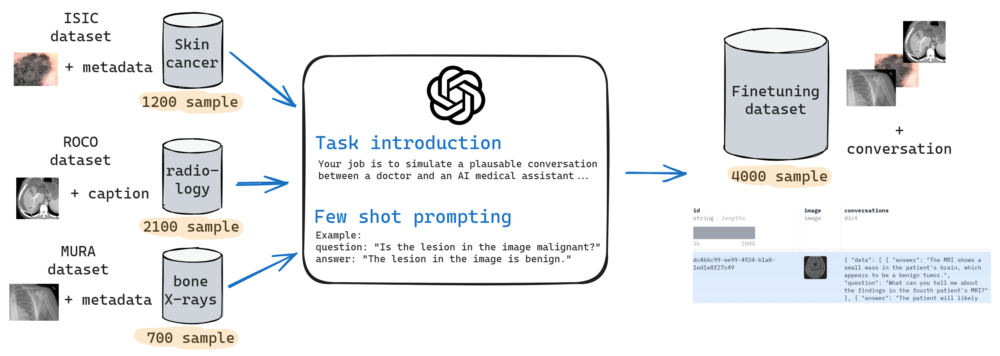
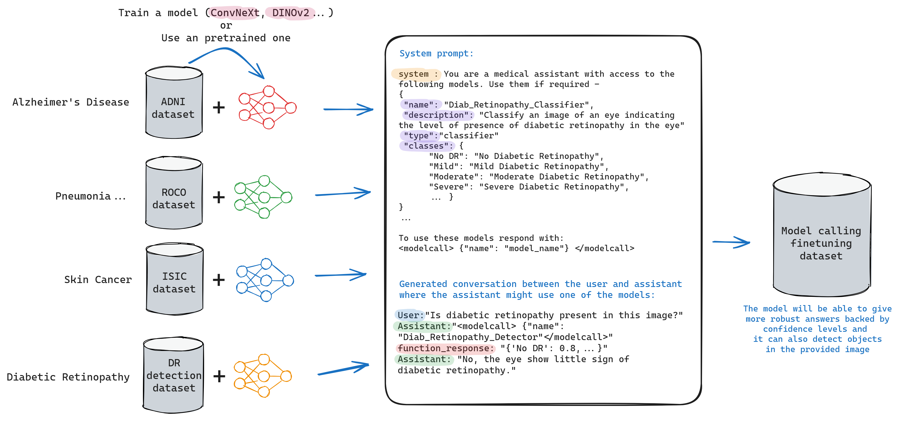
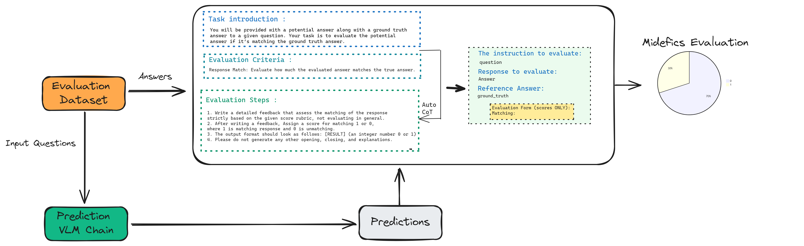
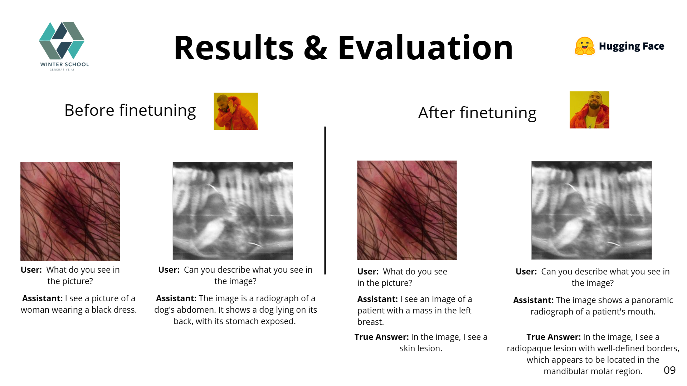

# IDEFICS

**IDEFICS** est un modèle multimodal de 80 milliards de paramètres qui accepte des séquences d'images et de textes en entrée et génère un texte cohérent en sortie. Il peut répondre à des questions sur les images, décrire du contenu visuel, créer des histoires basées sur plusieurs images, etc.

IDEFICS est une reproduction en libre accès de Flamingo et offre des performances comparables à celles du modèle original à code source fermé sur divers tests de compréhension image-texte. Il est disponible en deux variantes : 80 milliards de paramètres et 9 milliards de paramètres ($idefics-80B-instruct$ et $idefics-9B-instruct$).

## Caractéristiques

- **Multimodalité** : IDEFICS peut traiter à la fois des images et du texte, ce qui lui permet de répondre à des questions sur des images, de décrire du contenu visuel et de créer des histoires basées sur plusieurs images.
- **Performance** : IDEFICS offre des performances comparables à celles du modèle Flamingo à code source fermé sur divers tests de compréhension image-texte.
- **Variantes** : IDEFICS est disponible en deux variantes : 80 milliards de paramètres et 9 milliards de paramètres.

## Installation

```bash
pip install idefics
```


# MedIDEFICS

## About the project 
<p align="center">
  
</p>

**IDEFICS-instruct** résulte d’un entraînement supplémentaire d’IDEFICS sur des ensembles de données d'affinage supervisé et d'affinage via instructions. Cette amélioration permet d’augmenter nettement les performances sur des tâches spécifiques, faisant de idefics-9b-instruct un modèle puissant avec ses 9 milliards de paramètres, tout en améliorant ses capacités conversationnelles.

MedIDEFICS (**M**edical **I**mage-aware **D**ecoder **E**nhanced à la **F**lamingo with **I**nterleaved **C**ross-attention**S**) est une version fine-tunée du modèle IDEFICS-9b-instruct, lui-même une version optimisée du modèle IDEFICS-9b, adaptée au suivi d’instructions.

MedIDEFICS a été spécifiquement ajusté pour répondre à des questions médicales liées à des images. Ses capacités incluent la description de contenu visuel (diagnostic), la génération de recommandations, ou encore le fonctionnement en tant que modèle de langage médical, même sans entrée visuelle.

## Processus de préparation des données
Le jeu de données a été constitué à partir de [MURA](https://arxiv.org/abs/1712.06957), [ISIC](https://www.isic-archive.com/) and [ROCO](https://www.semanticscholar.org/paper/Radiology-Objects-in-COntext-(ROCO)%3A-A-Multimodal-Pelka-Koitka/a564fabf130ff6e2742cfba90c7a4018937d764d), qui sont des bases de données en accès libre contenant des images médicales.

Les conversations ont été générées automatiquement à l’aide de Ollama3-2 (GPT-3.5-turbo), en se basant sur les métadonnées associées à chaque image.

Le graphique ci-dessous donne un aperçu du processus de génération des données :



### Model calling


### Evaluation


### Before and after finetuning comparision


